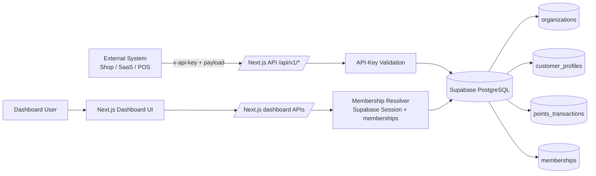
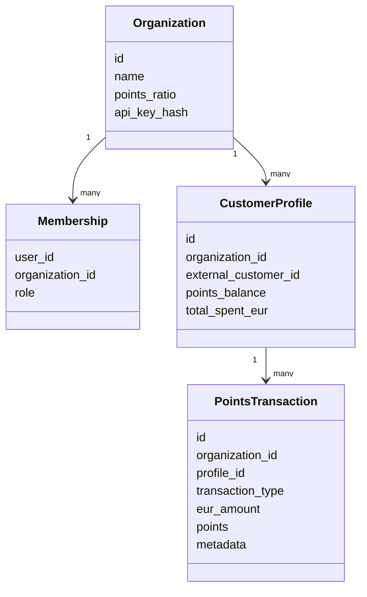
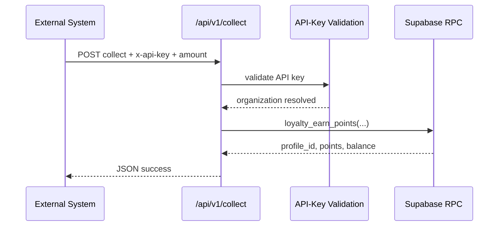
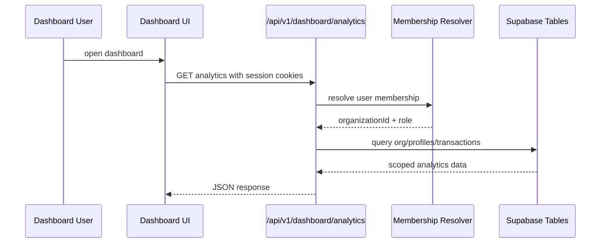
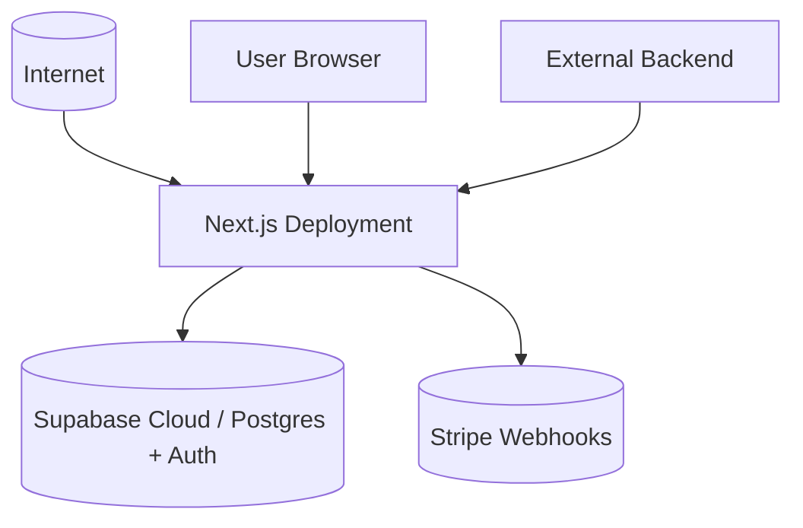

# 4+1 Views - System Architecture

## 1. Zweck und Kontext

Dieses Dokument beschreibt die Architektur des Projekts als **4+1 Views** Modell. Ziel ist es, die wichtigsten Struktur-, Laufzeit-, Entwicklungs- und Deploymentsichten fuer die aktuelle Implementierung der Loyalty Engine nachvollziehbar zu machen.

Das Projekt ist eine **mandantenfaehige B2B Loyalty-as-a-Service Plattform** auf Basis von Next.js, Supabase und Stripe. Es unterstuetzt zwei zentrale Betriebsmodi:

- **Public API Mode** fuer externe Systeme, die Punkte sammeln oder einloesen.
- **Dashboard Mode** fuer angemeldete Tenant-Nutzer, die Analytics, Profile und Einstellungen sehen.

### Relevante Einstiegspunkte

- [app/page.tsx](../app/page.tsx)
- [app/dashboard/page.tsx](../app/dashboard/page.tsx)
- [app/dashboard/tenant-console.tsx](../app/dashboard/tenant-console.tsx)
- [app/api/v1/collect/route.ts](../app/api/v1/collect/route.ts)
- [app/api/v1/redeem/route.ts](../app/api/v1/redeem/route.ts)
- [app/api/v1/dashboard/analytics/route.ts](../app/api/v1/dashboard/analytics/route.ts)
- [app/api/v1/dashboard/profiles/route.ts](../app/api/v1/dashboard/profiles/route.ts)
- [app/api/v1/dashboard/settings/ratio/route.ts](../app/api/v1/dashboard/settings/ratio/route.ts)
- [lib/loyalty/auth.ts](../lib/loyalty/auth.ts)
- [lib/loyalty/user-membership.ts](../lib/loyalty/user-membership.ts)
- [supabase/migrations/20260410_loyalty_engine.sql](../supabase/migrations/20260410_loyalty_engine.sql)
- [supabase/migrations/20260410_memberships.sql](../supabase/migrations/20260410_memberships.sql)

---

## 2. Systemueberblick

Die Architektur ist bewusst in zwei Sicherheits- und Verantwortungsbereiche getrennt:

1. **Externe Integrationen** schreiben Loyalty-Ereignisse ueber API-Keys.
2. **Dashboard-Nutzer** arbeiten ueber Supabase Auth plus Membership-Kontext.

Die Kernlogik liegt nicht im Frontend, sondern in PostgreSQL-RPC-Funktionen und serverseitigen Route Handlern. Dadurch bleiben Punktebuchung, Saldo-Pruefung und Historie atomar und nachvollziehbar.

---

## 3. Use-Case View

Diese Sicht beschreibt die wichtigsten fachlichen Szenarien.

### 3.1 Externe Use Cases

**UC1 - Punkte sammeln**

Ein externes Shopsystem meldet einen Kauf an die Loyalty Engine. Die API validiert den API-Key, bestimmt die Organization und ruft die DB-Funktion fuer das Punktegutschreiben auf. Dabei wird das Kundenprofil bei Bedarf automatisch angelegt.

**UC2 - Punkte einloesen**

Ein externes System loest Punkte ein. Die Anwendung prueft API-Key, Kundenkonto und Kontostand. Ist das Guthaben zu niedrig, wird der Vorgang abgelehnt.

**UC3 - Punkte-Ratio aendern**

Ein Tenant-Admin aktualisiert die Punkte-Ratio seiner Organization. Die Aenderung ist entweder ueber den API-Key-geschuetzten Org-Endpunkt oder ueber den dashboard-scoped Admin-Endpunkt moeglich.

**UC4 - Transaktionshistorie abrufen**

Ein System oder ein Dashboard-Nutzer laedt die komplette Historie eines Endkunden. Der Zugriff wird je nach Modus ueber API-Key oder Membership abgesichert.

### 3.2 Dashboard Use Cases

**UC5 - Organisation registrieren**

Ein angemeldeter Nutzer erstellt eine neue Organization. Dabei wird automatisch eine Admin-Membership fuer diesen User angelegt, sodass er sofort Zugriff auf das Dashboard der neuen Organisation hat.

**UC6 - Analytics und Profiles ansehen**

Ein Mitglied eines Tenants sieht nur die Daten seiner eigenen Organization: Kundenanzahl, Umsatz, Transaktionen, Tageshistorie und Profil-Liste.

**UC7 - Admin-Einstellungen pflegen**

Ein Admin aendert die Punkte-Ratio im Dashboard. Members sehen diese Funktion nicht bzw. werden serverseitig mit 403 abgewiesen.

### 3.3 Kompakte Szenarien

- **E-Commerce-Treueprogramm**: Earn bei Checkout, Redeem im Warenkorb.
- **SaaS-Nutzung**: Punkte fuer Aktivitaet, Einloesung fuer Upgrades oder Vorteile.
- **Einzelhandel**: Kassensystem schreibt Punkte in Echtzeit gut.
- **Support/Finance**: Transaktionshistorie eines Kunden wird fuer Nachvollziehbarkeit geladen.

---

## 4. Logical View

Die logische Sicht zeigt die fachlichen und technischen Bausteine des Systems.

### 4.1 Hauptmodule

**Presentation Layer**

- Landing Page unter [app/page.tsx](../app/page.tsx)
- Dashboard UI unter [app/dashboard/page.tsx](../app/dashboard/page.tsx) und [app/dashboard/tenant-console.tsx](../app/dashboard/tenant-console.tsx)

**API Layer**

- Public Loyalty API unter [app/api/v1/collect/route.ts](../app/api/v1/collect/route.ts) und [app/api/v1/redeem/route.ts](../app/api/v1/redeem/route.ts)
- Legacy API unter [app/api/v1/points/earn/route.ts](../app/api/v1/points/earn/route.ts) und [app/api/v1/points/redeem/route.ts](../app/api/v1/points/redeem/route.ts)
- Dashboard API unter [app/api/v1/dashboard/analytics/route.ts](../app/api/v1/dashboard/analytics/route.ts), [app/api/v1/dashboard/profiles/route.ts](../app/api/v1/dashboard/profiles/route.ts) und [app/api/v1/dashboard/settings/ratio/route.ts](../app/api/v1/dashboard/settings/ratio/route.ts)
- Payment Webhook unter [app/api/payment/webhook/route.ts](../app/api/payment/webhook/route.ts)

**Domain / Loyalty Services**

- API-Key Validierung in [lib/loyalty/auth.ts](../lib/loyalty/auth.ts)
- Membership-Kontext in [lib/loyalty/user-membership.ts](../lib/loyalty/user-membership.ts)
- Fehlerabbildung in [lib/loyalty/error-response.ts](../lib/loyalty/error-response.ts)
- Eingabevalidierung in [lib/loyalty/validators.ts](../lib/loyalty/validators.ts)

**Data Layer**

- Organisationsdaten, Profile und Transaktionen in [supabase/migrations/20260410_loyalty_engine.sql](../supabase/migrations/20260410_loyalty_engine.sql)
- Rollen und Memberships in [supabase/migrations/20260410_memberships.sql](../supabase/migrations/20260410_memberships.sql)

### 4.2 Zentrale Fachobjekte

- **Organization**: Tenant-Stammdaten, Punkte-Ratio, gehashter API-Key.
- **Membership**: Verknuepfung von Supabase-User zu Organization mit Rolle `admin` oder `member`.
- **Customer Profile**: Endkunde innerhalb einer Organization mit Punkte-Saldo und Gesamtumsatz.
- **Points Transaction**: Earn- oder Redeem-Buchung mit Historie und Metadaten.

### 4.3 Logische Datenfluesse

**Public API Flow**

1. Request mit `x-api-key` trifft ein.
2. [lib/loyalty/auth.ts](../lib/loyalty/auth.ts) hasht den Key und findet die Organization.
3. Die Route ruft eine Supabase RPC-Funktion auf.
4. Die DB erzeugt oder aktualisiert Profil, Saldo und Transaktionshistorie.
5. Die Route liefert einen strukturierten JSON-Response zurueck.

**Dashboard Flow**

1. Nutzer meldet sich ueber Supabase Auth an.
2. [lib/loyalty/user-membership.ts](../lib/loyalty/user-membership.ts) ermittelt den Membership-Kontext.
3. Dashboard-APIs laden nur Daten der eigenen Organization.
4. Admin-only Aktionen werden serverseitig mit Rolle und Statuscode abgesichert.

---

## 5. Process View

Die Prozesssicht beschreibt Laufzeitverhalten, Parallelitaet und Sicherheitspruefungen.

### 5.1 Request-Arten zur Laufzeit

**Typ A: API-Key-basierte Requests**

- Ziel: externe Integrationen
- Beispiele: Collect, Redeem, Ratio-Update, History
- Sicherheitsmechanismus: gehashter API-Key gegen `organizations.api_key_hash`

**Typ B: Session-basierte Requests**

- Ziel: Dashboard-Nutzer
- Beispiele: Analytics, Profiles, Dashboard-Ratio-Update, Membership-Ansicht
- Sicherheitsmechanismus: Supabase Session + Membership Lookup

### 5.2 Wichtige Prozessmerkmale

**Atomare Punktebuchung**

Die fachliche Buchung laeuft ueber `loyalty_earn_points` und `loyalty_redeem_points` in PostgreSQL. Das reduziert Race Conditions und sorgt dafuer, dass Saldo, Profil und Historie konsistent geschrieben werden.

**Auto-Profilanlage**

Beim ersten Kontakt mit einem Kunden kann das Profil automatisch entstehen. Dadurch koennen externe Systeme ohne vorherige Kundenanlage buchen.

**Redeem mit Negativpruefung**

Die Redeem-Logik bricht ab, wenn der Kontostand nicht ausreicht. Die API gibt dann einen Konfliktstatus zurueck.

**Role-Gating**

- Members sehen nur ihre Organization.
- Admins duerfen die Punkte-Ratio aendern.
- Nicht angemeldete Nutzer erhalten Auth-Fehler.

### 5.3 Beispielsequenzen

---

## 6. Development View

Die Entwicklungsansicht zeigt die Modulentrennung aus Sicht des Quellcodes und der Teamschnittstellen.

### 6.1 Struktur nach Verantwortlichkeiten

**App Router und UI**

- [app/page.tsx](../app/page.tsx)
- [app/dashboard/page.tsx](../app/dashboard/page.tsx)
- [app/dashboard/tenant-console.tsx](../app/dashboard/tenant-console.tsx)

**API-Endpunkte**

- [app/api/v1/*](../app/api/v1/)
- [app/api/payment/*](../app/api/payment/)
- [app/api/auth/*](../app/api/auth/)

**Wiederverwendbare Fachlogik**

- [lib/loyalty/*](../lib/loyalty/)
- [services/charts.services.ts](../services/charts.services.ts)
- [components/dashboard/*](../components/dashboard/)

**Supabase Schema und Migrationen**

- [supabase/migrations/20260410_loyalty_engine.sql](../supabase/migrations/20260410_loyalty_engine.sql)
- [supabase/migrations/20260410_memberships.sql](../supabase/migrations/20260410_memberships.sql)

### 6.2 Entwicklungsprinzipien

- **Separation of Concerns**: UI, API, Auth, Domain-Logik und DB-Schema sind getrennt.
- **Serverseitige Absicherung**: Kritische Pruefungen laufen nicht im Client, sondern in Route Handlern und DB.
- **Backward Compatibility**: Alte Endpunkte unter `/api/v1/points/*` bleiben parallel zu den neuen API-first Routen erhalten.
- **Testbarkeit**: Fachlogik ist in Hilfsfunktionen und DB-Funktionen aufgeteilt, damit Unit- und Route-Tests moeglich sind.

### 6.3 Team- und Wartungsaspekt

Die Repository-Struktur ist fuer kleine bis mittlere Teams gut wartbar, weil die Entscheidungspunkte an wenigen Stellen liegen:

- API-Key-Authentifizierung in [lib/loyalty/auth.ts](../lib/loyalty/auth.ts)
- Membership-Aufloesung in [lib/loyalty/user-membership.ts](../lib/loyalty/user-membership.ts)
- Public API in [app/api/v1/collect/route.ts](../app/api/v1/collect/route.ts) und [app/api/v1/redeem/route.ts](../app/api/v1/redeem/route.ts)
- Dashboard-Scoping in [app/api/v1/dashboard/*](../app/api/v1/dashboard/)

---

## 7. Physical View

Die physische Sicht beschreibt die Laufzeitumgebung und die Deployment-Annahmen.

### 7.1 Laufzeitbausteine

- **Next.js Runtime**: Host fuer Landing, Dashboard und Route Handlers.
- **Supabase Postgres**: Persistenz, RLS, Auth, RPC-Funktionen.
- **Stripe**: Zahlungsevents ueber den Webhook unter [app/api/payment/webhook/route.ts](../app/api/payment/webhook/route.ts).
- **Browser Client**: Dashboard-UI und Landing-Page.

### 7.2 Deployment-Annahme

Das System ist fuer ein klassisches SaaS-Deployment geeignet:

- Web-App als Next.js Deployment.
- Externe DB und Auth ueber Supabase.
- Webhooks von Stripe an einen oeffentlichen HTTP-Endpoint.
- Kein eigener Message Broker noetig fuer den aktuellen Stand.

### 7.3 Wichtige Umgebungsvariablen

- `NEXT_PUBLIC_SUPABASE_URL`
- `NEXT_PUBLIC_SUPABASE_ANON_KEY`
- `SUPABASE_SERVICE_ROLE_KEY`
- `NEXT_PUBLIC_STRIPE_PUBLISHABLE_KEY`
- `STRIPE_SECRET_KEY`
- `STRIPE_WEBHOOK_SECRET`

### 7.4 Betriebsrelevante Konsequenzen

- Ohne korrekte Supabase-Variablen ist Dashboard- und Auth-Betrieb unvollstaendig.
- Ohne `STRIPE_WEBHOOK_SECRET` ist die Webhook-Verifikation nicht moeglich.
- Ohne die Migrationen fehlen die Tabellen und RPC-Funktionen fuer die Loyalty-Logik.

---

## 8. Die "1" im 4+1 Modell: Zentrale Szenarien

Diese Szenarien verbinden alle Sichten miteinander und sind die wichtigsten Architektur-Checks.

### Szenario A - Collect

Ein Shop sendet einen Kauf an `/api/v1/collect`.

Erwartung:

- API-Key wird validiert.
- Organization wird aus dem Key ermittelt.
- `loyalty_earn_points` schreibt Profil, Saldo und Historie.
- Der Response enthaelt neue Punkte und den Saldo.

### Szenario B - Redeem

Ein Kunde loest Punkte ein.

Erwartung:

- API-Key validiert den Tenant.
- `loyalty_redeem_points` prueft den Kontostand.
- Bei zu wenig Punkten kommt ein Konfliktstatus.
- Bei Erfolg wird die Transaktion gespeichert.

### Szenario C - Dashboard Analytics

Ein eingeloggter Tenant-User oeffnet das Dashboard.

Erwartung:

- Session wird ueber Supabase Auth erkannt.
- Membership bestimmt Organisation und Rolle.
- Analytics und Profile werden nur fuer diese Organization geladen.

### Szenario D - Admin Ratio Update

Ein Admin aendert die Punkte-Ratio.

Erwartung:

- Server prueft Rolle `admin`.
- Aenderung betrifft nur die eigene Organization.
- Members erhalten 403.

---

## 9. Architekturentscheidungen

### 9.1 Warum API-Key und Membership getrennt sind

Die Plattform bedient zwei sehr unterschiedliche Vertrauensmodelle:

- Externe Systeme duerfen ohne Supabase-Login schreiben, aber nur ueber einen gehashten API-Key.
- Menschliche Nutzer im Dashboard arbeiten mit Session und Membership.

Diese Trennung reduziert Risiko, weil ein API-Key nie Dashboard-Rechte ersetzt und ein Dashboard-Login nie automatisch externe Integrationsrechte erzeugt.

### 9.2 Warum die Buchung in SQL-Funktionen liegt

Die Punkte-Logik ist fachlich kritisch und sollte atomar bleiben. Die DB-Funktionen kapseln:

- Saldo-Pruefung
- Profilerstellung
- Historienbuchung
- Rueckgabe der neuen Werte

### 9.3 Warum legacy und neue Routen parallel existieren

Die Legacy-Routen unter `/api/v1/points/*` bleiben fuer Kompatibilitaet erhalten, waehrend die neuen API-first Routen unter `/api/v1/collect` und `/api/v1/redeem` die sicherere Form bevorzugen.

---

## 10. Offene Punkte und Erweiterungen

Moegliche naechste Architektur-Erweiterungen waeren:

- Team-Management im Dashboard fuer Mitgliedseinladungen und Rollenwechsel.
- Explizite Audit-Logs fuer Admin-Aktionen.
- Hintergrundverarbeitung fuer Webhooks und Folgeprozesse.
- Erweiterte Deployment-Skizze mit Monitoring, Alerting und Secret-Rotation.

---

## 11. Kurzfazit

Die Loyalty Engine ist architektonisch klar aufgeteilt in:

- **API-getriebene Integrationen** fuer externe Systeme,
- **Membership-basierte Dashboards** fuer menschliche Nutzer,
- **atomare DB-Logik** fuer Punkte und Historie,
- **saubere Laufzeittrennung** zwischen UI, API, Auth und Persistenz.

Damit passt das Projekt sehr gut zu einem 4+1 Views Modell, weil sich die wesentlichen Entscheidungen entlang von Use Cases, Modulen, Prozessen, Entwicklung und Deployment sauber darstellen lassen.