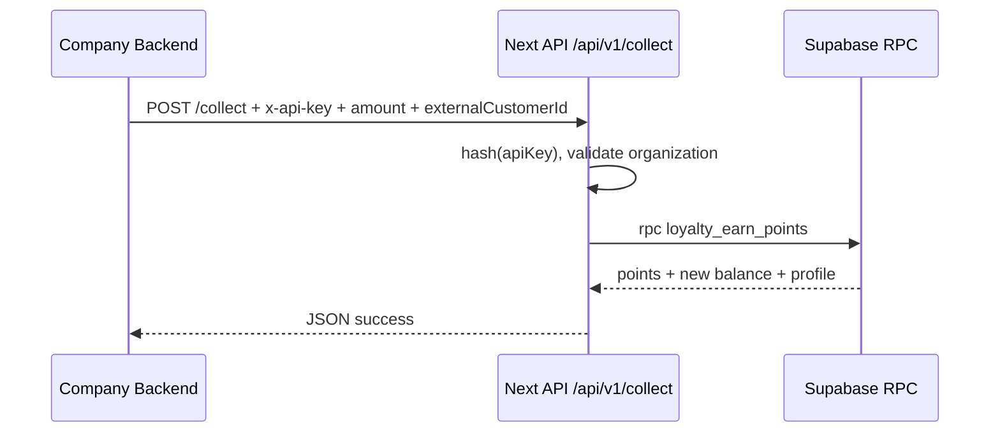
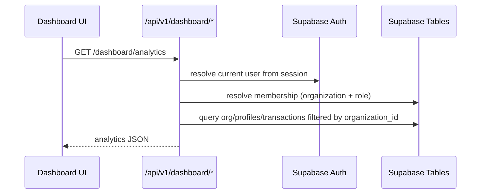

**Gesamtbild**
Die App ist eine Next.js App-Router Anwendung, die als externe Loyalty-Logik-Engine funktioniert.  
Es gibt zwei Hauptbereiche:

1. Landing + Auth-Flow für Nutzer
2. API-first Loyalty-Backend + Dashboard für Tenants

Die technische Basis ist:
- Next.js Route Handler für API
- Supabase (PostgreSQL + Auth)
- Multi-Tenancy über Organization + Membership

---

**Wie die App strukturiert ist**
- Startseite/Landing liegt in page.tsx und App.tsx
- Dashboard liegt in page.tsx und tenant-console.tsx
- API liegt unter api
- Zentrale Loyalty-Serverlogik liegt unter loyalty

---

**Datenmodell in Supabase**
Du hast zwei Migrationsdateien:

- Loyalty-Kernmodell: 20260410_loyalty_engine.sql
- Membership/Rollenmodell: 20260410_memberships.sql

Wichtige Tabellen:
- organizations: Tenant-Stammdaten, points_ratio, api_key_hash
- customer_profiles: Kunden je Organization, Punkte-Saldo, Gesamtumsatz
- points_transactions: Historie aller earn/redeem Transaktionen
- memberships: Verknüpfung Supabase-User zu Organization mit Rolle admin/member

Wichtige SQL-Funktionen:
- loyalty_earn_points
- loyalty_redeem_points

Diese Funktionen kapseln die eigentliche Punkte-Logik atomar in der DB.

---

**Sicherheitsmodell**
Es gibt zwei Sicherheitsachsen:

1. API-Key Security für externe API-Calls
- Header x-api-key wird gehasht
- Hash wird gegen organizations geprüft
- Implementiert in auth.ts

2. User/Membership Security für Dashboard
- Eingeloggter Supabase-User wird aus Session gelesen
- Membership bestimmt organization_id und role
- Implementiert in user-membership.ts
- RLS-Policies in Migration schützen die Sicht auf Organizations, Profiles und Transactions

Zusätzlich:
- Einheitliche JSON-Fehler mit sinnvollen HTTP-Status in error-response.ts

---

**API-Layer: was es jetzt gibt**
Organisation:
- Register: route.ts
- Ratio-Update per Org-ID + API-Key: [app/api/v1/organizations/[organizationId]/ratio/route.ts](app/api/v1/organizations/[organizationId]/ratio/route.ts)

Punkte-API (kompatibel):
- Alte Form mit organizationId im Body:
  - route.ts
  - route.ts
- Neue Form wie von dir gewünscht: 
  - route.ts
  - route.ts

Bei collect/redeem wird die Organization direkt aus x-api-key aufgelöst. Das ist sicherer, weil keine fremde organizationId im Body eingeschleust werden kann.

Dashboard-API (membership-basiert):
- Analytics: route.ts
- Profiles: route.ts
- Settings Ratio admin-only: route.ts

---

**Dashboard: wie es funktioniert**
Die UI in tenant-console.tsx macht folgendes:

- Tenant registrieren
- Bei geladenem Dashboard:
  - KPIs (Kunden, Umsatz, Transaktionen, Earn/Redeem Summen)
  - Punkte-Historie pro Tag
  - Customer-Profiles Tabelle
- Ratio-Änderung über admin-geschützten Endpoint

Wichtig:
- Dashboard-Daten kommen jetzt aus membership-scoped Endpoints
- Nutzer sehen nur Daten ihrer eigenen Organization
- Admins dürfen ratio ändern, Members nicht

---

**Auth-Flow und Membership-Zuweisung**
Beim Registrieren einer neuen Organization wird, falls ein User eingeloggt ist, automatisch eine admin-Membership angelegt.  
Das passiert in route.ts über user-membership.ts.

Damit ist der neue Tenant sofort im Dashboard des Erstellers sichtbar.

---

**Doku und API-Tools**
Du hast jetzt vollständige Doku/Artefakte:

- Hauptdoku: README.md
- OpenAPI: openapi.yaml
- Enterprise Integrationsguide: integration-guide-enterprise.md
- Quickstart 10 Minuten: quickstart-10min.md
- Postman Collection: loyalty-engine.postman_collection.json
- Insomnia Export: loyalty-engine.insomnia.json

---

**Was du lokal brauchst**
In deiner lokalen Env müssen gesetzt sein:
- NEXT_PUBLIC_SUPABASE_URL
- NEXT_PUBLIC_SUPABASE_ANON_KEY
- SUPABASE_SERVICE_ROLE_KEY

Datei: \.env.local

Und beide SQL-Migrationen müssen in Supabase ausgeführt sein.

---

**Request-Lifecycle in kurz**
Externe Shop-Integration:
1. Shop ruft collect mit x-api-key auf
2. API validiert Key, löst Organization auf
3. DB-Funktion schreibt Punkte + Historie
4. Response liefert neuen Saldo

Dashboard:
1. User ist über Supabase Auth eingeloggt
2. Membership bestimmt Organization
3. Analytics/Profiles werden nur für diese Organization geladen
4. Ratio-Änderung nur mit Rolle admin

---

Wenn du willst, schreibe ich dir als nächsten Schritt noch eine Architektur-Übersicht als Diagramm (Request-Flow + Security-Layer + Datenfluss) und lege sie als Markdown-Datei in docs ab.


----------------------------------------------------------
# Loyalty Engine - Vollstaendige Systemdokumentation

Diese Datei beschreibt die komplette Umsetzung des aktuellen Stands:

- Architektur der App
- Datenmodell in Supabase
- API-Layer (collect, redeem, earn, dashboard)
- Dashboard-Datenfluss
- User-/Role-Modell (memberships)
- Sicherheitskonzept
- Fehlerbehandlung und Edge Cases
- End-to-End Flows
- Betriebs- und Integrationshinweise

## 1. Ziel des Systems

Die Anwendung ist eine Multi-Tenant Loyalty-as-a-Service Plattform.
Unternehmen koennen ihr eigenes Treueprogramm ueber API-Endpunkte betreiben. Die Plattform uebernimmt die gesamte Punkte-Logik extern.

Hauptfunktionen:

- Punkte sammeln (collect/earn)
- Punkte einloesen (redeem)
- Automatische Profilerstellung
- Vollstaendige Transaktionshistorie
- Dashboard mit Analytics, Profilen und Settings

## 2. Tech Stack und App-Struktur

Stack:

- Next.js App Router
- Supabase (PostgreSQL + Auth)
- Route Handler unter /api/v1

Wichtige Einstiegsdateien:

- Landing/App Einstieg: [app/page.tsx](app/page.tsx)
- Dashboard Einstieg: [app/dashboard/page.tsx](app/dashboard/page.tsx)
- Dashboard UI: [app/dashboard/tenant-console.tsx](app/dashboard/tenant-console.tsx)

## 3. High-Level Architektur

```mermaid
flowchart LR
  A[External Company Backend] -->|x-api-key + payload| B[/api/v1/collect or /api/v1/redeem]
  C[Dashboard User Browser] --> D[Next.js Dashboard UI]
  D --> E[/api/v1/dashboard/*]

  B --> F[API Key Validation]
  F --> G[Supabase RPC Functions]
  G --> H[(organizations)]
  G --> I[(customer_profiles)]
  G --> J[(points_transactions)]

  E --> K[Membership Resolver via Supabase Auth]
  K --> L[(memberships)]
  E --> H
  E --> I
  E --> J
```

## 4. Datenmodell

### 4.1 Kern-Migration

Datei: [supabase/migrations/20260410_loyalty_engine.sql](supabase/migrations/20260410_loyalty_engine.sql)

Tabellen:

- organizations
  - id
  - name
  - points_ratio
  - api_key_hash
- customer_profiles
  - organization_id
  - external_customer_id
  - points_balance
  - total_spent_eur
- points_transactions
  - organization_id
  - profile_id
  - transaction_type (earn/redeem)
  - eur_amount
  - points
  - metadata

SQL-Funktionen:

- loyalty_earn_points
  - rechnet Betrag in Punkte um
  - erstellt Profile automatisch falls noetig
  - erhoeht Balance
  - schreibt Historie
- loyalty_redeem_points
  - prueft Balance
  - zieht Punkte nur bei ausreichendem Saldo ab
  - schreibt Historie
  - liefert status/message

### 4.2 Membership-Migration

Datei: [supabase/migrations/20260410_memberships.sql](supabase/migrations/20260410_memberships.sql)

Tabelle:

- memberships
  - user_id (Supabase Auth User)
  - organization_id
  - role (admin/member)

RLS-Policies:

- memberships nur fuer eigenen auth.uid sichtbar/veraenderbar
- organizations/customer_profiles/points_transactions nur fuer Nutzer mit passender Membership sichtbar

## 5. Security-Design

Es gibt zwei Security-Ebenen:

### 5.1 API-Key Security fuer externe Integrationen

Pfad:

- [lib/loyalty/auth.ts](lib/loyalty/auth.ts)

Logik:

1. x-api-key aus Header lesen
2. SHA-256 Hash bilden
3. gegen organizations.api_key_hash validieren
4. Organization aus Key ableiten

Wichtig:

- kein Klartext-Key in DB
- bei collect/redeem muss keine organizationId vom Client vertraut werden

### 5.2 Membership Security fuer Dashboard

Pfad:

- [lib/loyalty/user-membership.ts](lib/loyalty/user-membership.ts)

Logik:

1. Supabase Session User aus Cookies ermitteln
2. membership fuer user_id laden
3. organizationId + role in Context verwenden

Ergebnis:

- Dashboard-User sehen nur ihre Organization
- Admin-only Aktionen (z. B. ratio update) sind role-gated

## 6. Error Handling und Edge Cases

Pfad:

- [lib/loyalty/error-response.ts](lib/loyalty/error-response.ts)

Mapping:

- Invalid/Missing API key -> 401
- Membership/Forbidden -> 403
- Not found -> 404
- Insufficient points balance -> 409
- sonst -> 400

Explizite Edge Cases:

- Redeem bei zu wenig Punkten
- Missing x-api-key
- Kein Membership-Eintrag fuer eingeloggten User
- Ungueltige numerische Eingaben (pointsRatio, amountEur, points)

## 7. API-Layer im Detail

### 7.1 Tenant / Organization

- Register: [app/api/v1/organizations/register/route.ts](app/api/v1/organizations/register/route.ts)
  - erstellt organization + api key
  - wenn User eingeloggt ist: automatische admin-membership

- Ratio Update (legacy/key+org): [app/api/v1/organizations/[organizationId]/ratio/route.ts](app/api/v1/organizations/[organizationId]/ratio/route.ts)

### 7.2 Punkte-Endpunkte

Legacy-Endpunkte (mit organizationId im Body):

- [app/api/v1/points/earn/route.ts](app/api/v1/points/earn/route.ts)
- [app/api/v1/points/redeem/route.ts](app/api/v1/points/redeem/route.ts)

Neue API-First Endpunkte (Organization aus API-Key):

- [app/api/v1/collect/route.ts](app/api/v1/collect/route.ts)
- [app/api/v1/redeem/route.ts](app/api/v1/redeem/route.ts)

### 7.3 Dashboard-Endpunkte (membership-scoped)

- Analytics: [app/api/v1/dashboard/analytics/route.ts](app/api/v1/dashboard/analytics/route.ts)
- Profiles: [app/api/v1/dashboard/profiles/route.ts](app/api/v1/dashboard/profiles/route.ts)
- Settings ratio (admin): [app/api/v1/dashboard/settings/ratio/route.ts](app/api/v1/dashboard/settings/ratio/route.ts)

## 8. Dashboard-Build

Dashboard-Komponente:

- [app/dashboard/tenant-console.tsx](app/dashboard/tenant-console.tsx)

Dargestellte Inhalte:

- Hero/Statusbereich
- Tenant-Erstellung
- Membership-basiertes Dashboard laden
- KPI-Karten
  - customersCount
  - totalTransactions
  - totalRevenueEur
  - Punkte earn/redeem Summen
- Punkte-Historie pro Tag
- Customer-Profile Tabelle
- Ratio-Update (admin-only serverseitig abgesichert)

Hinweis:

- UI ist inkl. Dark Mode konsistent umgesetzt

## 9. End-to-End Flows

### 9.1 Externe Integrations-Flow



### 9.2 Dashboard-Flow



## 10. Konfiguration und Secrets

Benoetigte Variablen lokal:

- NEXT_PUBLIC_SUPABASE_URL
- NEXT_PUBLIC_SUPABASE_ANON_KEY
- SUPABASE_SERVICE_ROLE_KEY

Dateien:

- Beispiel: [.env.example](.env.example)
- Lokal: [.env.local](.env.local)

Wichtig:

- service role key nur serverseitig nutzen
- nie in Client-Bundle oder oeffentliche Repos legen

## 11. Doku- und API-Artefakte

- Hauptuebersicht: [README.md](README.md)
- OpenAPI: [docs/openapi.yaml](docs/openapi.yaml)
- Enterprise Guide: [docs/integration-guide-enterprise.md](docs/integration-guide-enterprise.md)
- Quickstart: [docs/quickstart-10min.md](docs/quickstart-10min.md)
- Postman: [collections/loyalty-engine.postman_collection.json](collections/loyalty-engine.postman_collection.json)
- Insomnia: [collections/loyalty-engine.insomnia.json](collections/loyalty-engine.insomnia.json)

## 12. Was bei einem frischen Setup zu tun ist

1. Beide SQL-Dateien in Supabase ausfuehren:
- [supabase/migrations/20260410_loyalty_engine.sql](supabase/migrations/20260410_loyalty_engine.sql)
- [supabase/migrations/20260410_memberships.sql](supabase/migrations/20260410_memberships.sql)

2. Env Variablen setzen in [.env.local](.env.local)

3. App starten

4. Als eingeloggter User eine Organization registrieren

5. Dashboard laden und Daten pruefen

## 13. Design-Entscheidungen (warum so gebaut)

- Punkte-Logik in SQL-RPC:
  - atomar, zentral, konsistent
- API-Key gehashed speichern:
  - kein Secret im Klartext in DB
- collect/redeem ohne orgId im Request:
  - reduziert Manipulationsflaeche
- Membership + RLS:
  - saubere Multi-Tenant Datentrennung
- Admin-only Settings Endpoint:
  - rolebasierte Schreibrechte

## 14. Aktueller Status

- API-Layer fertig
- Dashboard-Anbindung fertig
- Membership-/Role-Modell fertig
- Error-Handling fuer Edge Cases integriert
- Lint ist sauber
